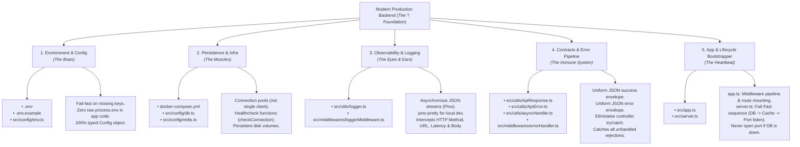

---
tags:
  - backend
  - architecture
  - node
  - express
  - best-practices
last_reviewed: 2026-10-02
related_notes:
  - "[[backend/node/production-backend-architecture-and-structure]]"
  - "[[backend/express/centralized-error-handling-and-api-contracts]]"
  - "[[backend/express/structured-logging-pino]]"
  - "[[database/redis/redis-architecture-caching-and-ttl]]"
---

# The Five Pillars of Production Backend Architecture

> [!CHECKLIST] Active Recall Self-Test
> - [ ] What are the **5 Non-Negotiable Pillars** of modern production backend engineering?
> - [ ] Why is typing raw `process.env.VARIABLE` directly inside route controllers considered a critical architectural violation?
> - [ ] What is the "Fail-Fast" boot sequence, and why must database and cache health checks resolve *before* `app.listen()`?
> - [ ] How does standardizing `ApiResponse` and `ApiError` envelopes eliminate frontend JSON parsing errors?
> - [ ] What is the "One-Shot Agent Prompt" to scaffold an enterprise backend in seconds?

---

## 1. The Core Problem: The Blank-Canvas Trap

When starting a new backend project, engineers frequently experience the "blank canvas" trap: they jump straight into writing business routes and controllers before establishing fundamental infrastructure. This produces predictable architectural debt:

1. **Scattered Environment Variables:** Calls to `process.env.JWT_SECRET` are sprinkled across 30 files. If an environment variable is omitted or misspelled on production deploy, the server starts fine, accepts traffic, and only crashes hours later when a user hits that specific endpoint.
2. **Zombie Server Race Conditions:** Running `app.listen(PORT)` while the database connection is still pending causes incoming requests to hit uninitialized database connection pools, crashing with unhandled promise rejections.
3. **Inconsistent Error Contracts:** Route A returns `{ error: "Not found" }`, Route B returns `{ message: "Bad ID", success: false }`, and an unhandled crash returns raw HTML stack traces from Express. The frontend team cannot build predictable error handling.
4. **Synchronous Logging Bottlenecks:** Using `console.log()` blocks the Node.js event loop on every incoming request under high concurrency, degrading throughput and leaking sensitive credentials.

---

## 2. The Mental Model: The "Emmet `!`" of Backend Engineering

Just as typing `!` in VS Code expands into the perfect HTML5 boilerplate, every production backend across the software industry consists of exactly **5 non-negotiable pillars** before writing a single line of business logic:



---

## 3. Production Code Breakdown

### Pillar 1: Environment & Config (The Brain)

Validates environment variables at process bootstrap using Zod. If a required secret is missing, it crashes immediately with a clean diagnostic message.

```typescript
// src/config/env.ts
import dotenv from "dotenv";
import { z } from "zod";

dotenv.config();

const envSchema = z.object({
  NODE_ENV: z.enum(["development", "test", "production"]).default("development"),
  PORT: z.string().transform(Number).default("8000"),
  DATABASE_URL: z.string().url("DATABASE_URL must be a valid connection string"),
  REDIS_URL: z.string().url().default("redis://localhost:6379"),
  JWT_SECRET: z.string().min(32, "JWT_SECRET must be at least 32 characters"),
  CORS_ORIGIN: z.string().default("*"),
});

const parsedEnv = envSchema.safeParse(process.env);

if (!parsedEnv.success) {
  console.error("💥 FATAL: Invalid environment configuration:");
  console.error(parsedEnv.error.format());
  process.exit(1); // Fail-fast: Terminate immediately before server boots
}

export const config = Object.freeze(parsedEnv.data);
```

### Pillar 2: Persistence & Infrastructure (The Muscles)

Exports dedicated connection pools and an exportable health-check function.

```typescript
// src/config/db.ts
import pg from "pg";
import { config } from "./env.js";

const { Pool } = pg;

export const dbPool = new Pool({
  connectionString: config.DATABASE_URL,
  max: 20, // Optimal pool size
  idleTimeoutMillis: 30000,
});

export async function checkDatabaseConnection(): Promise<void> {
  const client = await dbPool.connect();
  try {
    await client.query("SELECT 1;");
  } finally {
    client.release();
  }
}
```

### Pillar 3: Observability & Logging (The Eyes & Ears)

Asynchronous structured logging via Pino with sensitive credential redaction.

```typescript
// src/utils/logger.ts
import pino from "pino";
import { config } from "../config/env.js";

export const logger = pino({
  level: config.NODE_ENV === "production" ? "info" : "debug",
  transport:
    config.NODE_ENV !== "production"
      ? { target: "pino-pretty", options: { colorize: true } }
      : undefined,
  redact: ["req.headers.authorization", "req.headers.cookie", "password", "token"],
});
```

### Pillar 4: Contracts & Error Pipeline (The Immune System)

Standardized success envelopes, typed operational errors, and asynchronous controller wrappers.

```typescript
// src/utils/ApiResponse.ts
export class ApiResponse<T> {
  constructor(
    public readonly statusCode: number,
    public readonly data: T,
    public readonly message: string = "Success",
    public readonly success: boolean = statusCode < 400
  ) {}
}

// src/utils/ApiError.ts
export class ApiError extends Error {
  constructor(
    public readonly statusCode: number,
    public readonly message: string = "Something went wrong",
    public readonly errors: unknown[] = [],
    stack = ""
  ) {
    super(message);
    this.name = "ApiError";
    if (stack) {
      this.stack = stack;
    } else {
      Error.captureStackTrace(this, this.constructor);
    }
  }
}

// src/utils/asyncHandler.ts
import { Request, Response, NextFunction, RequestHandler } from "express";

export const asyncHandler = (fn: RequestHandler): RequestHandler => {
  return (req: Request, res: Response, next: NextFunction) => {
    Promise.resolve(fn(req, res, next)).catch(next);
  };
};

// src/middlewares/errorHandler.ts
import { ErrorRequestHandler } from "express";
import { ApiError } from "../utils/ApiError.js";
import { logger } from "../utils/logger.js";

export const errorHandler: ErrorRequestHandler = (err, req, res, next) => {
  let error = err;

  if (!(error instanceof ApiError)) {
    const statusCode = error.statusCode || 500;
    const message = error.message || "Internal Server Error";
    error = new ApiError(statusCode, message, [], err.stack);
  }

  logger.error({
    message: error.message,
    statusCode: error.statusCode,
    url: req.originalUrl,
    method: req.method,
    stack: error.stack,
  });

  return res.status(error.statusCode).json({
    success: false,
    statusCode: error.statusCode,
    message: error.message,
    errors: error.errors,
    ...(process.env.NODE_ENV !== "production" && { stack: error.stack }),
  });
};
```

### Pillar 5: App & Lifecycle Bootstrapper (The Heartbeat)

Decouples routing definition (`app.ts`) from fail-fast execution (`server.ts`).

```typescript
// src/app.ts
import express from "express";
import cors from "cors";
import helmet from "helmet";
import { config } from "./config/env.js";
import { errorHandler } from "./middlewares/errorHandler.js";

const app = express();

app.use(helmet());
app.use(cors({ origin: config.CORS_ORIGIN, credentials: true }));
app.use(express.json({ limit: "16kb" }));
app.use(express.urlencoded({ extended: true, limit: "16kb" }));

// Mount routes here:
// app.use("/api/v1/auth", authRouter);

// Global Error Handler (MUST have 4 arguments)
app.use(errorHandler);

export default app;
```

```typescript
// src/server.ts
import app from "./app.js";
import { config } from "./config/env.js";
import { checkDatabaseConnection } from "./config/db.js";
import { checkRedisConnection } from "./config/redis.js";
import { logger } from "./utils/logger.js";

async function bootstrap() {
  try {
    logger.info("Initializing system pre-flight checks...");

    // 1. Verify Database
    await checkDatabaseConnection();
    logger.info("🍃 Database connection verified.");

    // 2. Verify Redis Cache
    await checkRedisConnection();
    logger.info("⚡ Redis cache connection verified.");

    // 3. Start Network Listener
    const server = app.listen(config.PORT, () => {
      logger.info(`🚀 Production Server listening on port ${config.PORT}`);
    });

    // Graceful Shutdown
    const shutdown = (signal: string) => {
      logger.info(`Received ${signal}. Draining connections...`);
      server.close(() => {
        logger.info("HTTP server closed cleanly.");
        process.exit(0);
      });
    };

    process.on("SIGINT", () => shutdown("SIGINT"));
    process.on("SIGTERM", () => shutdown("SIGTERM"));
  } catch (error) {
    logger.fatal({ err: error }, "💥 Fatal system boot failure. Halting container.");
    process.exit(1); // Fail-fast: Trigger container orchestrator restart
  }
}

bootstrap();
```

---

## 4. The One-Shot AI Scaffolding Prompt

Save this prompt in your notes. When starting any new backend project with an AI coding agent, paste this instruction to generate a production-ready baseline:

> **"Scaffold the 5-pillar production backend foundation for [Express / Fastify + TypeScript]:**
> 1. **The Brain:** Centralized, typed config module validating `.env` with Zod (zero raw `process.env` in controllers).
> 2. **The Muscles:** PostgreSQL (`pg`) and Redis (`ioredis`) connection pools with exportable `checkConnection()` health functions.
> 3. **The Eyes & Ears:** Pino structured logger with asynchronous JSON streams and redaction of tokens/passwords.
> 4. **The Immune System:** Standardized `ApiResponse<T>`, custom `ApiError`, `asyncHandler` wrapper, and 4-argument Express `errorHandler` middleware.
> 5. **The Heartbeat:** Decoupled `app.ts` (middleware/routes) and `server.ts` (Fail-Fast boot sequence verifying DB + Redis before `app.listen()`, plus `SIGINT`/`SIGTERM` graceful teardown).
> **Implement with strict TypeScript typings and zero compiler diagnostics."**
